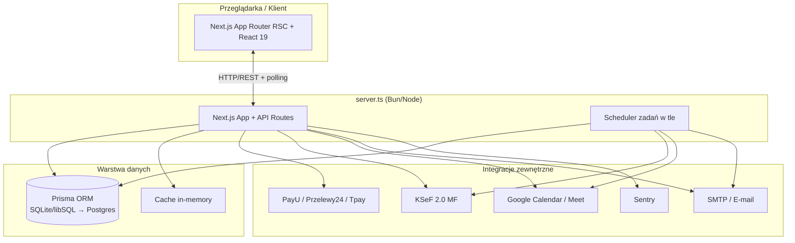
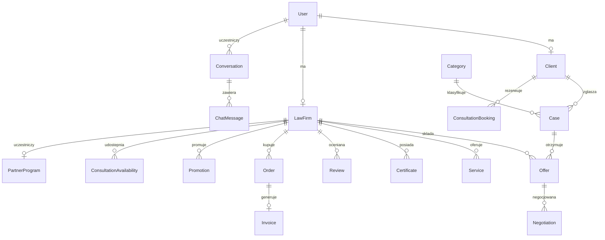
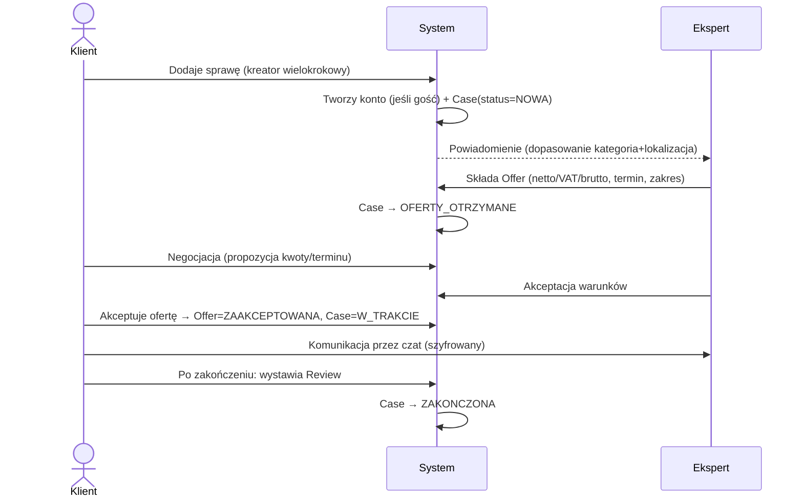
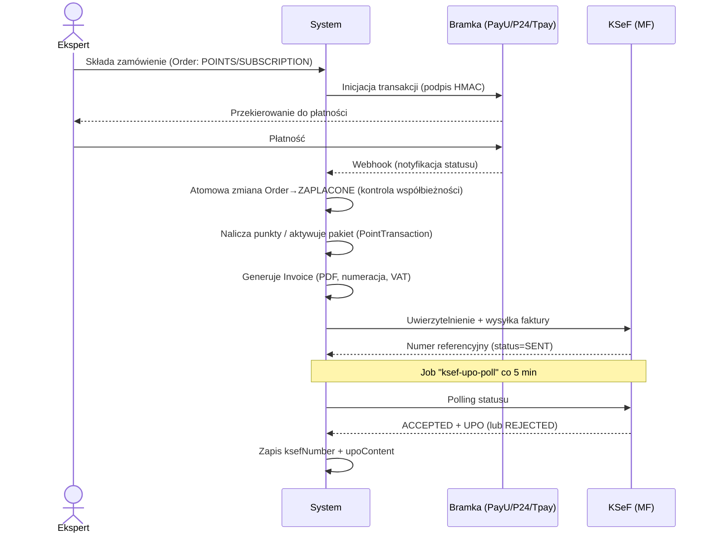
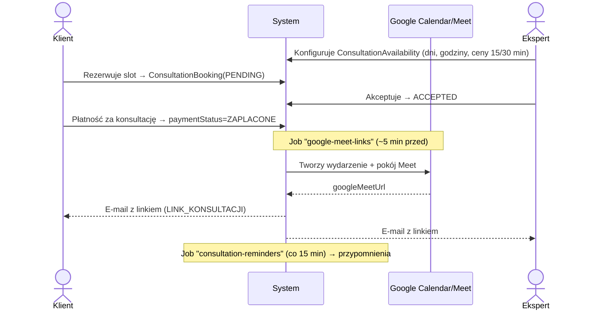
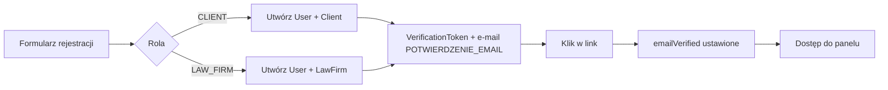
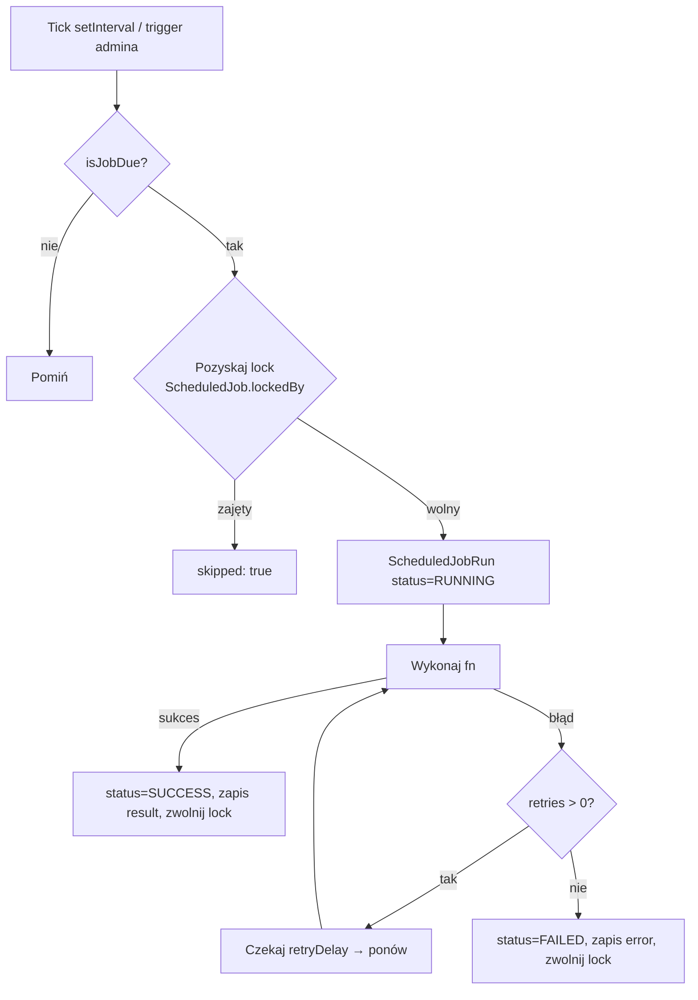

# ProstaSprawa.pl — Szczegółowa dokumentacja techniczna

> Dokument towarzyszący wycenie (`wycena-i-dokumentacja-techniczna.md`).
> Opisuje model danych, powierzchnię API, przepływy procesów, model uprawnień, zadania w tle, bezpieczeństwo i wymagania niefunkcjonalne — wszystko wyprowadzone bezpośrednio z kodu źródłowego.
> **Data:** 2026-06-09

## Spis treści
1. [Architektura logiczna](#1-architektura-logiczna)
2. [Model danych (66 modeli, 30 enumów)](#2-model-danych)
3. [Powierzchnia API (204 endpointy)](#3-powierzchnia-api)
4. [Kluczowe przepływy procesów](#4-kluczowe-przeplywy-procesow)
5. [Model ról i uprawnień](#5-model-rol-i-uprawnien)
6. [Zadania w tle (scheduler)](#6-zadania-w-tle-scheduler)
7. [Powiadomienia, e-maile, integracje](#7-powiadomienia-e-maile-integracje)
8. [Bezpieczeństwo i RODO](#8-bezpieczenstwo-i-rodo)
9. [Konfiguracja środowiska](#9-konfiguracja-srodowiska)
10. [Wymagania niefunkcjonalne (NFR)](#10-wymagania-niefunkcjonalne-nfr)
11. [Dług techniczny i ryzyka implementacyjne](#11-dlug-techniczny-i-ryzyka-implementacyjne)

---

## 1. Architektura logiczna

Aplikacja jest **monolitem modularnym** Next.js uruchamianym przez niestandardowy `server.ts`, który przy starcie inicjalizuje scheduler. Cztery strefy routingu: `(public)`, `panel-klienta`, `panel-eksperta`, `admin` + `sklep`.

---

## 2. Model danych

**66 modeli, 30 typów wyliczeniowych, 2177 linii schematu.** Pogrupowane w domeny:

| # | Domena | Modele (reprezentatywne) | Liczba |
| :-- | :-- | :-- | --: |
| 1 | Użytkownicy i autoryzacja | `User`, `Account`, `Session`, `VerificationToken`, `LoginHistory`, `UserBlock`, `UserOnlineStatus` | 7 |
| 2 | Profile klientów i ekspertów | `Client`, `LawFirm`, `Service`, `Certificate`, `AccountManager`, `LawFirmVoivodeship`, `LawFirmCity`, `LawFirmCategory`, `FavoriteLawFirm` | 9 |
| 3 | Słowniki geo i kategorie | `Voivodeship`, `City`, `PostalCode`, `Category`, `BlogCategory` | 5 |
| 4 | Sprawy, oferty, negocjacje | `Case`, `Offer`, `Negotiation` | 3 |
| 5 | Komunikacja (czat i wiadomości) | `Message`, `Conversation`, `ChatMessage`, `TypingIndicator` | 4 |
| 6 | Opinie | `Review`, `ReviewReport` | 2 |
| 7 | Dokumenty | `Document` | 1 |
| 8 | Blog | `BlogPost` | 1 |
| 9 | Monetyzacja (zamówienia/punkty/pakiety/faktury) | `Order`, `OrderOverride`, `SubscriptionPlan`, `PointTransaction`, `Invoice` | 5 |
| 10 | Promocje | `Promotion`, `PromotionConfig`, `PromotionStats` | 3 |
| 11 | Program partnerski | `PartnerProgram`, `PartnerPointsHistory` | 2 |
| 12 | Konsultacje | `ConsultationAvailability`, `ConsultationBooking` | 2 |
| 13 | Powiadomienia i e-mail | `Notification`, `NotificationSettings`, `EmailTemplate`, `EmailLog`, `ScheduledEmail`, `Newsletter` | 6 |
| 14 | Statystyki i odznaki | `LawFirmStats`, `LawFirmCategoryStats`, `Badge`, `LawFirmBadge` | 4 |
| 15 | CMS i strony | `Module`, `Page`, `PageModule`, `HomepageTestimonial`, `HelpCategory`, `HelpQuestion`, `Advertisement` | 7 |
| 16 | System i scheduler | `Settings`, `SystemLog`, `ScheduledJob`, `ScheduledJobRun` | 4 |
| 17 | Kontakt | `ContactForm` | 1 |
| | **RAZEM** | | **66** |

### 2.1. Centralny diagram relacji (rdzeń domeny)

### 2.2. Katalog typów wyliczeniowych (30)

| Enum | Wartości | Zastosowanie |
| :-- | :-- | :-- |
| `UserRole` | CLIENT, LAW_FIRM, ADMIN | Role systemowe |
| `UserStatus` | ACTIVE, INACTIVE, SUSPENDED, BLOCKED | Stan konta |
| `ClientType` | INDIVIDUAL, BUSINESS | Typ klienta |
| `LawFirmType` | OSOBA_FIZYCZNA, SPOLKA_CYWILNA, …, SPOLKA_ZOO, INNY | Forma prawna eksperta |
| `OfferType` | STALA_WSPOLPRACA, JEDNORAZOWA_USLUGA, KONSULTACJA, WSZYSTKIE | Typ oferty eksperta |
| `SubscriptionPackage` | PODSTAWOWY, STANDARD, PREMIUM, BIZNES | Pakiety (440/880/1320/1980 zł/rok) |
| `CategoryType` | SPRAWY_FIRMOWE, SPRAWY_PRYWATNE | Typ kategorii prawnej |
| `CaseType` | OSOBA_PRYWATNA, FIRMA, ORGANIZACJA | Typ sprawy |
| `CaseStatus` | NOWA, OFERTY_OTRZYMANE, W_TRAKCIE, ZAKONCZONA, ANULOWANA | Cykl życia sprawy |
| `PreferredContact` | EMAIL, TELEFON, OBA | Preferencja kontaktu |
| `OfferStatus` | ZLOZONA, ZAAKCEPTOWANA, ODRZUCONA, NEGOCJACJE, WYGASLA | Cykl życia oferty |
| `PaymentTerms` | PRZELEW_7/14/30, Z_GORY, RATY, INNY | Warunki płatności oferty |
| `MessageStatus` | SENDING, SENT, DELIVERED, READ, ERROR | Status wiadomości czatu |
| `ServiceUnit` | ZA_USLUGE, ZA_GODZINE, RYCZALT, DO_UZGODNIENIA | Jednostka rozliczenia usługi |
| `OrderType` | POINTS, SUBSCRIPTION | Typ zamówienia |
| `PaymentMethod` | PAYU, PRZELEWY24, TPAY, PRZELEW, PAYPAL, BACS, POINTS, TEST | Metoda płatności |
| `PaymentStatus` | OCZEKUJE, ZAPLACONE, ANULOWANE, ZWROT | Status płatności |
| `PointTransactionType` | SUBSCRIPTION_PURCHASE, POINTS_PURCHASE, PROMOTION_PURCHASE, OFFER_HIGHLIGHT, PARTNER_BONUS, ADMIN_ADJUSTMENT, REFUND, … | Księgowanie punktów |
| `PromotionType` | PODBICIE_OGLOSZENIA, WYROZNIENIE, TOP_LISTA, STRONA_GLOWNA, POLECANI_PRAWNICY, NAJCZESCIEJ_KONSULTOWANE | Typy promocji (20–600 pkt) |
| `NotificationType` | 12 wartości (NOWA_OFERTA, NOWA_WIADOMOSC, …, KONSULTACJA_*) | Powiadomienia in-app |
| `InvoiceStatus` | DRAFT, ISSUED, SENT, PAID, CANCELLED | Status faktury |
| `ContactSubject` | INFORMACJA, WSPARCIE, WSPOLPRACA, REKLAMACJA, INNE | Temat formularza kontaktowego |
| `ModuleType` | TEMPLATE, EDITABLE_HTML | Typ modułu CMS |
| `LogLevel` | DEBUG, INFO, WARNING, ERROR, CRITICAL | Poziom logów systemowych |
| `EmailType` | 25 wartości (NOWA_SPRAWA, RESET_HASLA, …, LINK_KONSULTACJI) | Typy szablonów e-mail |
| `ConsultationStatus` | PENDING, ACCEPTED, REJECTED, COMPLETED, CANCELLED | Status konsultacji |
| `BadgeConditionType` | YEARS_IN_SERVICE, WON_CASES, REVIEWS_COUNT, BLOG_POSTS_COUNT, OFFERS_SUBMITTED, PROFILE_VIEWS | Warunki odznak |
| `EmailLogStatus` | SUCCESS, FAILED | Status wysyłki e-mail |
| `ScheduledEmailStatus` | PENDING, SENT, FAILED, CANCELLED | Status zaplanowanego e-maila |
| `JobRunStatus` | RUNNING, SUCCESS, FAILED | Status uruchomienia zadania |

### 2.3. Strategia indeksowania
Schemat stosuje intensywne indeksowanie — praktycznie każdy klucz obcy i pole filtrowane ma `@@index`, a relacje N:N mają złożone `@@unique` (np. `Conversation` po `[clientUserId, lawFirmUserId]`, `LawFirmCategory` po `[lawFirmId, categoryId]`). `Conversation` denormalizuje ostatnią wiadomość (`lastMessageText/At/SenderId`) dla wydajności listy konwersacji.

---

## 3. Powierzchnia API

**204 endpointy REST** (`route.ts`) w 46 grupach. Rozkład:

| Grupa | Endpointy | Zakres |
| :-- | --: | :-- |
| `admin/*` | 53 | Pełne zarządzanie systemem (patrz 3.1) |
| `law-firms/*` | 25 | Katalog, profile, wizytówki, weryfikacja |
| `auth/*` | 13 | Rejestracja, logowanie, reset, weryfikacja e-mail |
| `conversations/*` | 9 | Czat: wątki, wysyłka, odczyt, archiwizacja, blokowanie |
| `payments/*` | 8 | Inicjacja i webhooki bramek |
| `blog/*` | 7 | Wpisy, kategorie |
| `upload/*`, `promotions/*`, `offers/*`, `cron/*`, `clients/*` | 5 każda | Pliki, promocje, oferty, zadania CRON, klienci |
| `reviews/*`, `partner-program/*` | 4 każda | Opinie, program partnerski |
| `cases/*`, `categories/*`, `invoices/*`, `messages/*`, `newsletter/*`, `notifications/*`, `users/*` | 3 każda | Domeny podstawowe |
| pozostałe (`consultations`, `certificates`, `badges`, `ads`, `services`, `orders`, `email-templates`, `subscription-plans`, `voivodeships`, `law-firm`, …) | 1–2 każda | Funkcje wspierające |

### 3.1. Podgrupy panelu administracyjnego (`/api/admin`, 53 endpointy)
`users`, `law-firms`, `import-law-firms`, `cases`, `cities`, `reviews` (+`/status`), `blog`, `pages`, `modules`, `help/categories`, `help/questions`, `notifications`, `newsletter`, `email-logs`, `scheduled-emails`, `send-test-email`, `account-managers` (+`/upload-avatar`), `ads`, `testimonials`, `promotion-configs`, `order-overrides` (+`/ranking`), `partner-program`, `transakcje` (+`/punkty`), `blocks` (+`/[key]/render`), `scheduler`, `logs`, `settings`, `profile` (+`/change-password`), `dashboard/stats`.

### 3.2. Konwencje
- Walidacja wejścia: **Zod** (współdzielone schematy klient/serwer).
- Autoryzacja: sesja **NextAuth v5**; endpointy `cron/*` i `partner-program/allocate-points` chronione nagłówkiem `Authorization: Bearer <CRON_SECRET>` z zachowaniem **fail-closed** (503 przy braku sekretu).
- Rate limiting: in-memory na wrażliwych trasach (auth, kontakt).

---

## 4. Kluczowe przepływy procesów

### 4.1. Cykl życia sprawy (rdzeń marketplace)

### 4.2. Płatność (punkty / pakiet) + faktura + KSeF

### 4.3. Konsultacja online z Google Meet

### 4.4. Rejestracja i weryfikacja e-mail

> Uwaga bezpieczeństwa: przypisanie roli przy rejestracji jest ograniczone po stronie serwera (nie można samodzielnie nadać sobie roli ADMIN — commit `fb07784`).

### 4.5. Cykl życia zadania w tle (lock + retry + monitoring)

---

## 5. Model ról i uprawnień

### 5.1. Role systemowe
- **CLIENT** — dodawanie spraw, przegląd/akceptacja ofert, negocjacje, czat, konsultacje, opinie, ulubieni.
- **LAW_FIRM (Ekspert)** — wizytówka, oferty, blog, faktury, pakiety, punkty, konsultacje, program partnerski; uprawnienia **zależne od pakietu**.
- **ADMIN** — pełne zarządzanie (53 endpointy), moderacja, finanse, CMS, scheduler.

### 5.2. Macierz uprawnień pakietów eksperta (`lib/permissions.ts`)

| Cecha / Limit | PODSTAWOWY | STANDARD | PREMIUM | BIZNES |
| :-- | :--: | :--: | :--: | :--: |
| Cena (rok) | 440 zł | 880 zł | 1320 zł | 1980 zł |
| Aktywne sprawy | 10 | 20 | ∞ | ∞ |
| Kategorie | 2 | 5 | 10 | ∞ |
| Województwa | 1 | 2 | 3 | 6 |
| Miasta | 15 | 15 | 25 | 35 |
| Priorytet w wyszukiwaniu | ✅ | ✅ | ✅ | ✅ |
| Zaawansowane statystyki | — | — | ✅ | ✅ |
| Promowanie profilu | — | — | ✅ | ✅ |
| Cover / banner | — | — | ✅ | ✅ |
| Wsparcie marketingowe | — | — | ✅ | ✅ |
| Blog eksperta | — | — | — | ✅ |
| Skill Law Focus | — | — | — | ✅ |
| Ukrywanie reklam | — | — | ✅ | ✅ |
| Załączniki | — | — | ✅ | ✅ |
| Punkty gratis | 20 | 30 | 50 | 100 |

> Egzekwowanie: po wygaśnięciu pakietu (`isPackageExpired`) wszystkie funkcje premium są blokowane, a limity spadają do wartości bazowych (0). Funkcje sprawdzane przez `canAccessFeature`, limity przez `checkLimit`.

---

## 6. Zadania w tle (scheduler)

`server.ts` przy starcie wywołuje `initScheduler()`. **8 zadań cyklicznych** z persystencją (`ScheduledJob`), rozproszonym lockiem (`lockedBy`), retry i historią (`ScheduledJobRun`):

| Zadanie | Interwał (prod) | Funkcja | Retry |
| :-- | :-- | :-- | :--: |
| `promotions` | 1 h | Deaktywacja + odnawianie wygasłych promocji | 2 |
| `scheduled-emails` | 1 min | Wysyłka kolejki e-mail | 1 |
| `consultation-reminders` | 15 min | Przypomnienia o konsultacjach | 2 |
| `expired-subscriptions` | 1 h | Czyszczenie wygasłych pakietów | 2 |
| `rankings` | 12 h | Przeliczanie rankingu kancelarii | 1 |
| `google-meet-links` | 1 min | Generowanie linków Meet (~5 min przed) | 1 |
| `ksef-upo-poll` | 5 min | Status + UPO faktur KSeF | 1 |
| `cleanup-job-runs` | 24 h | Retencja historii uruchomień | 1 |

> **Korekta względem starszego audytu (`plan.md`):** scheduler **nie jest** już czystym `setInterval` w pamięci. Stan przetrwa restart (nadrabianie pominiętych uruchomień przez `isJobDue`), a lock w bazie zapobiega podwójnemu wykonaniu przy wielu instancjach. `setInterval` pełni już tylko rolę wyzwalacza tików. Panel admina (`/admin/scheduler`) listuje zadania i pozwala je uruchamiać ręcznie (`triggerJob`).

---

## 7. Powiadomienia, e-maile, integracje

### 7.1. Powiadomienia in-app (`NotificationType`, 12 typów)
NOWA_OFERTA, NOWA_WIADOMOSC, ZMIANA_STATUSU, NOWA_OPINIA, MALY_STAN_PUNKTOW, KONIEC_SUBSKRYPCJI, NOWA_KONSULTACJA, KONSULTACJA_ZAAKCEPTOWANA/ODRZUCONA/ZAPLACONA/ANULOWANA, SYSTEM.

Granularne preferencje w `NotificationSettings` (~25 przełączników: e-mail, SMS, tryb urlopowy `urlop`, dźwięk, awatar, prośby o opinie, wiadomości zbiorcze).

### 7.2. Szablony e-mail (`EmailType`, 25 typów)
Transakcyjne (rejestracja, reset hasła, potwierdzenie e-mail), domenowe (nowa sprawa/oferta, akceptacja/odrzucenie, opinie, płatność), subskrypcyjne (wygaśnięcie, niski stan punktów) oraz pełen zestaw konsultacyjny (nowa, akceptacja, odrzucenie, płatność, anulowanie, przypomnienie, link Meet). Wysyłka przez kolejkę SMTP z logowaniem (`EmailLog`) i planowaniem (`ScheduledEmail`).

### 7.3. Integracje (warstwa `lib/`)
| Integracja | Plik(i) | Mechanizm |
| :-- | :-- | :-- |
| PayU | `payu.ts` | OAuth client_credentials, podpis, webhook |
| Przelewy24 | `przelewy24.ts` | Rejestracja transakcji, CRC, weryfikacja |
| Tpay | `tpay.ts` | Rejestracja, podpis HMAC, webhook |
| KSeF 2.0 | `ksef.ts`, `invoice-generator.ts` | Auth, wysyłka XML, UPO, polling |
| Google Meet | `google-meet.ts` | `googleapis`, fallback mock przy braku kluczy |
| E-mail | `smtp.ts`, `email.ts`, `scheduled-emails.ts` | Kolejka SMTP, szablony, logi |
| Szyfrowanie | `encryption.ts` | AES-256-CBC z IV per wiadomość |
| Monitoring | Sentry (`@sentry/nextjs`) | Błędy + performance |

---

## 8. Bezpieczeństwo i RODO

### 8.1. Mechanizmy bezpieczeństwa (zaimplementowane)
- **Hasła:** hash bcrypt (`bcryptjs`); pole `password` nullable dla kont OAuth.
- **Szyfrowanie treści czatu:** AES-256-CBC, `contentIv` per wiadomość (`ENCRYPTION_KEY`).
- **Soft-delete** użytkowników (`deletedAt`) — zgodność z prawem do usunięcia przy zachowaniu integralności.
- **Rate limiting** in-memory na wrażliwych trasach (auth, kontakt) — commit `eb2df6f`.
- **Walidacja sygnatur plików** (magic bytes) + utwardzone nagłówki dla uploadów/serwowania — commit `c8a492e`.
- **Ochrona CRON** — `cron-auth` fail-closed: brak `CRON_SECRET` ⇒ 503 (commit `168ffe8`).
- **Ograniczenie nadawania ról** w rejestracji (brak self-eskalacji do ADMIN) — commit `fb07784`.
- **Audyt:** `LoginHistory` (udane/nieudane logowania, IP, UA), `SystemLog` (poziomy DEBUG–CRITICAL), `EmailLog`.
- **Monitoring:** Sentry (rotacja DSN — commit `498b459`).

### 8.2. RODO / prywatność
- **Zgody** rejestrowane na poziomie danych: `zgodaRegulamin`, `zgodaNewsletter`, `zgodaMarketing` (Client), `zgodaPrzetwarzanie` (LawFirm), double opt-in newslettera (`tokenPotwierdzajacy`, `unsubscribeToken`).
- **CMP:** przewidziana integracja **c15t** (`NEXT_PUBLIC_C15T_PROJECT_ID`).
- **Dane wrażliwe** (opisy spraw, załączniki) — szyfrowanie transmisji (HTTPS) + szyfrowanie treści czatu.
- **Do uzupełnienia produkcyjnie:** rejestr czynności przetwarzania, retencja/archiwizacja, eksport danych na żądanie (DSAR).

---

## 9. Konfiguracja środowiska

Zmienne z `.env.example` (grupy):

| Grupa | Zmienne | Uwaga |
| :-- | :-- | :-- |
| Baza | `DATABASE_URL` | Domyślnie SQLite (`file:./prisma/dev.db`) |
| Auth | `NEXTAUTH_URL`, `NEXTAUTH_SECRET`, `AUTH_SECRET`, `AUTH_TRUST_HOST` | NextAuth v5 |
| Szyfrowanie | `ENCRYPTION_KEY` | Czat AES-256 |
| CRON | `CRON_SECRET` | **Wymagany** na prod (inaczej 503) |
| E-mail | `EMAIL_SERVER_HOST/PORT/USER/PASSWORD`, `EMAIL_FROM` | SMTP |
| Przelewy24 | `P24_MERCHANT_ID`, `P24_POS_ID`, `P24_CRC`, `P24_API_KEY`, `P24_SANDBOX`, `P24_API_URL` | |
| PayU | `PAYU_POS_ID`, `PAYU_MD5_KEY`, `PAYU_CLIENT_ID`, `PAYU_CLIENT_SECRET`, `PAYU_ENVIRONMENT` | |
| Upload | `NEXT_PUBLIC_UPLOAD_SERVICE_URL`, `UPLOADTHING_TOKEN` | |
| CMP | `NEXT_PUBLIC_C15T_PROJECT_ID` | Consent management |

> **Luki konfiguracyjne do uzupełnienia:** brak w `.env.example` zmiennych **Tpay** (mimo `lib/tpay.ts`) oraz poświadczeń **Google API** (Calendar/Meet). Wymaga uzupełnienia przed produkcyjnym uruchomieniem tych integracji.

---

## 10. Wymagania niefunkcjonalne (NFR)

| Kategoria | Stan / wymaganie docelowe |
| :-- | :-- |
| **Wydajność** | Cache in-memory + intensywne indeksy + denormalizacja konwersacji. Docelowo: distributed cache (Redis), optymalizacja N+1. |
| **Skalowalność** | App bezstanowy; scheduler z lockiem w DB wspiera wiele instancji. Wąskie gardło: SQLite/libSQL → migracja na PostgreSQL z connection poolingiem. |
| **Dostępność** | Graceful shutdown schedulera; retry zadań; kolejka e-mail odporna na chwilowe awarie SMTP. |
| **Obserwowalność** | Sentry + `SystemLog` + `EmailLog` + `LoginHistory` + `ScheduledJobRun`. Docelowo: log strukturalny (Pino/Winston), `/api/health`. |
| **Bezpieczeństwo** | Patrz §8. Docelowo: audyt OWASP, sanityzacja wejścia HTML (CMS/blog), CSP. |
| **Wersjonowanie API** | Brak (`/api/*` bez wersji) — do rozważenia przy otwarciu publicznego API. |
| **Internacjonalizacja** | Domena PL-only; i18n jako potencjalne rozszerzenie. |

---

## 11. Dług techniczny i ryzyka implementacyjne

Zidentyfikowane bezpośrednio w kodzie (istotne dla harmonogramu i kosztu — zob. rejestr ryzyk w wycenie):

1. **Real-time czatu = polling.** `lib/socket.ts` to stub (`getIO()` → `null`). Statusy/typing odpytywane przez REST. Pełny WebSocket/SSE do dokończenia (ujęte w module 17 wyceny).
2. **Baza SQLite/libSQL** (`provider = "sqlite"`) — produkcyjnie wymaga PostgreSQL (współbieżność, skala).
3. **`next.config.ts`:** `ignoreBuildErrors: true` — błędy typów TS ukryte; przy przejęciu kodu wymaga włączenia strict i naprawy (commit `808bc39`).
4. **Brak testów automatycznych** w repozytorium (jednostkowe/integ./E2E) i CI zakomentowane (`deploy.yml`, commit `04c3620`).
5. **Tpay/Google** — kod gotowy, brak konfiguracji środowiskowej (§9).
6. **Mock Google Meet** przy braku kluczy — ryzyko wprowadzenia użytkownika w błąd na prod.

> Pozytywy: dobra separacja `app`/`lib`/`components`, bogaty i konsekwentnie indeksowany model danych, scheduler z persystencją i lockiem, wdrożone szyfrowanie czatu, rate limiting, walidacja sygnatur plików, fail-closed CRON oraz integracja Sentry.

---

*Dokument wyprowadzony z analizy kodu źródłowego (stan repo na 2026-06-09). Stanowi podstawę techniczną wyceny w `wycena-i-dokumentacja-techniczna.md`.*
