# Diagram połączeń danych (ERD)

Wygenerowany na podstawie stanu kumulacyjnego migracji (`prisma/schema.prisma`).
Pokazuje encje i ich relacje (klucze obce). Notacja: *crow's foot* — `||--o{` = jeden do wielu (strona "wiele" opcjonalna), `||--o|` = jeden do co najwyżej jednego.

Podgląd: otwórz w VS Code (rozszerzenie Mermaid) lub na GitHub — diagram renderuje się automatycznie.

```mermaid
erDiagram
    %% ========================================================
    %% UŻYTKOWNICY I AUTORYZACJA
    %% ========================================================
    User {
        string id PK
        string email UK
        enum   role "CLIENT|LAW_FIRM|ADMIN"
        enum   status
        string voivodeshipId FK
    }
    Account {
        string id PK
        string userId FK
        string provider
    }
    Session {
        string id PK
        string userId FK
        string sessionToken UK
    }
    NotificationSettings {
        string id PK
        string userId FK,UK
    }
    Notification {
        string id PK
        string userId FK
        enum   typ
    }
    LoginHistory {
        string id PK
        string userId FK
        bool   success
    }

    User ||--o{ Account                : "ma konta OAuth"
    User ||--o{ Session                : "ma sesje"
    User ||--o| NotificationSettings   : "ustawienia"
    User ||--o{ Notification           : "powiadomienia"
    User ||--o{ LoginHistory           : "historia logowań"

    %% ========================================================
    %% KLIENCI I KANCELARIE (PROFILE UŻYTKOWNIKA)
    %% ========================================================
    Client {
        string id PK
        string userId FK,UK
        enum   clientType
        int    punktySaldo
    }
    LawFirm {
        string id PK
        string userId FK,UK
        string slug UK
        string nip UK
        string mainCategoryId FK
        string expertiseCategoryId FK
        string accountManagerId FK
    }
    AccountManager {
        string id PK
        string email UK
    }

    User ||--o| Client                 : "profil klienta"
    User ||--o| LawFirm                : "profil eksperta"
    AccountManager ||--o{ LawFirm      : "opiekuje się"

    %% ========================================================
    %% GEOGRAFIA (SŁOWNIKI)
    %% ========================================================
    Voivodeship {
        string id PK
        string nazwa UK
        string slug UK
    }
    County {
        string id PK
        string voivodeshipId FK
        string nazwa
    }
    City {
        string id PK
        string voivodeshipId FK
        string countyId FK
        string nazwa
    }
    PostalCode {
        string id PK
        string cityId FK
        string code
    }

    Voivodeship ||--o{ County          : "zawiera powiaty"
    Voivodeship ||--o{ City            : "zawiera miasta"
    Voivodeship ||--o{ User            : "lokalizacja użytkownika"
    County      ||--o{ City            : "zawiera miasta"
    City        ||--o{ PostalCode      : "kody pocztowe"

    %% ========================================================
    %% OBSZAR DZIAŁANIA KANCELARII (M:N PRZEZ TABELE ŁĄCZĄCE)
    %% ========================================================
    LawFirmVoivodeship {
        string id PK
        string lawFirmId FK
        string voivodeshipId FK
    }
    LawFirmCounty {
        string id PK
        string lawFirmId FK
        string countyId FK
    }
    LawFirmCity {
        string id PK
        string lawFirmId FK
        string cityId FK
    }

    LawFirm     ||--o{ LawFirmVoivodeship : "działa w"
    Voivodeship ||--o{ LawFirmVoivodeship : "obejmuje"
    LawFirm     ||--o{ LawFirmCounty      : "działa w"
    County      ||--o{ LawFirmCounty      : "obejmuje"
    LawFirm     ||--o{ LawFirmCity        : "działa w"
    City        ||--o{ LawFirmCity        : "obejmuje"

    %% ========================================================
    %% KATEGORIE / SPECJALIZACJE
    %% ========================================================
    Category {
        string id PK
        string slug UK
        string parentId FK
        enum   typ
    }
    ExpertiseCategory {
        string id PK
        string parentId FK
        string nazwa
    }
    LawFirmCategory {
        string id PK
        string lawFirmId FK
        string categoryId FK
        int    percentage
    }

    Category          ||--o{ Category          : "hierarchia (parent)"
    Category          ||--o{ LawFirm           : "główna kategoria"
    Category          ||--o{ LawFirmCategory   : "przypisana"
    LawFirm           ||--o{ LawFirmCategory   : "specjalizacje"
    ExpertiseCategory ||--o{ ExpertiseCategory : "drzewo (parent)"
    ExpertiseCategory ||--o{ LawFirm           : "typ działalności"

    %% ========================================================
    %% SPRAWY -> OFERTY -> NEGOCJACJE
    %% ========================================================
    Case {
        string id PK
        string clientId FK
        string categoryId FK
        string voivodeshipId FK
        string cityId FK
        enum   status
    }
    Offer {
        string id PK
        string caseId FK
        string lawFirmId FK
        enum   status
        float  kwotaBrutto
    }
    Negotiation {
        string id PK
        string offerId FK
        string clientId FK
        float  propozycjaKwoty
    }

    Client      ||--o{ Case            : "zgłasza sprawy"
    Category    ||--o{ Case            : "kategoria sprawy"
    Voivodeship ||--o{ Case            : "lokalizacja"
    City        ||--o{ Case            : "lokalizacja"
    Case        ||--o{ Offer           : "otrzymuje oferty"
    LawFirm     ||--o{ Offer           : "składa oferty"
    Offer       ||--o{ Negotiation     : "negocjacje"
    Client      ||--o{ Negotiation     : "negocjuje"

    %% ========================================================
    %% WIADOMOŚCI I CZAT
    %% ========================================================
    Message {
        string id PK
        string senderId FK
        string receiverId FK
        string caseId FK
        bool   przeczytana
    }
    Conversation {
        string id PK
        string clientUserId FK
        string lawFirmUserId FK
    }
    ChatMessage {
        string id PK
        string conversationId FK
        string senderId FK
        enum   status
    }
    TypingIndicator {
        string id PK
        string conversationId FK
        string userId
    }
    Document {
        string id PK
        string lawFirmId FK
        string clientUserId FK
        string conversationId FK
    }

    User         ||--o{ Message          : "wysłane/odebrane"
    Case         ||--o{ Message          : "dot. sprawy"
    User         ||--o{ Conversation     : "klient / ekspert"
    Conversation ||--o{ ChatMessage      : "wiadomości czatu"
    User         ||--o{ ChatMessage      : "nadawca"
    Conversation ||--o{ TypingIndicator  : "status pisania"
    Conversation ||--o{ Document         : "załączniki"
    LawFirm      ||--o{ Document         : "dokumenty kancelarii"
    User         ||--o{ Document         : "wysłane przez klienta"

    %% ========================================================
    %% OPINIE
    %% ========================================================
    Review {
        string id PK
        string lawFirmId FK
        string clientId FK
        int    ocenaOgolna
    }
    ReviewReport {
        string id PK
        string reviewId FK
        string userId FK
    }

    LawFirm ||--o{ Review               : "otrzymuje opinie"
    Client  ||--o{ Review               : "wystawia opinie"
    Review  ||--o{ ReviewReport         : "zgłoszenia"
    User    ||--o{ ReviewReport         : "zgłasza"

    %% ========================================================
    %% ULUBIONE / TREŚCI KANCELARII
    %% ========================================================
    FavoriteLawFirm {
        string id PK
        string clientId FK
        string lawFirmId FK
    }
    Service {
        string id PK
        string lawFirmId FK
    }
    Certificate {
        string id PK
        string lawFirmId FK
    }
    BlogCategory {
        string id PK
        string slug UK
    }
    BlogPost {
        string id PK
        string lawFirmId FK
        string sponsoredLawFirmId FK
        string categoryId FK
        string slug UK
    }

    Client       ||--o{ FavoriteLawFirm : "ulubione"
    LawFirm      ||--o{ FavoriteLawFirm : "dodana do ulubionych"
    LawFirm      ||--o{ Service         : "usługi"
    LawFirm      ||--o{ Certificate     : "certyfikaty"
    LawFirm      ||--o{ BlogPost        : "autor"
    LawFirm      ||--o{ BlogPost        : "sponsor"
    BlogCategory ||--o{ BlogPost        : "kategoria wpisu"

    %% ========================================================
    %% PŁATNOŚCI: ZAMÓWIENIA, FAKTURY, PUNKTY, SUBSKRYPCJE
    %% ========================================================
    SubscriptionPlan {
        string id PK
        enum   typ UK
        float  cena12Miesiecy
    }
    Order {
        string id PK
        string orderNumber UK
        string lawFirmId FK
        string subscriptionPlanId FK
        enum   orderType
        enum   statusPlatnosci
    }
    Invoice {
        string id PK
        string invoiceNumber UK
        string orderId FK,UK
        string lawFirmId FK
    }
    PointTransaction {
        string id PK
        string lawFirmId FK
        int    amount
        enum   type
    }

    LawFirm          ||--o{ Order            : "zamówienia"
    SubscriptionPlan ||--o{ Order            : "wybrany pakiet"
    Order            ||--o| Invoice          : "faktura"
    LawFirm          ||--o{ Invoice          : "faktury"
    LawFirm          ||--o{ PointTransaction : "transakcje punktów"

    %% ========================================================
    %% PROMOCJE
    %% ========================================================
    Promotion {
        string id PK
        string lawFirmId FK
        enum   typPromocji
    }
    PromotionStats {
        string id PK
        string promotionId FK
        datetime date
    }

    LawFirm   ||--o{ Promotion           : "wykupione promocje"
    Promotion ||--o{ PromotionStats      : "statystyki dzienne"

    %% ========================================================
    %% STATYSTYKI KANCELARII
    %% ========================================================
    LawFirmStats {
        string id PK
        string lawFirmId FK
        int    year
        int    month
    }
    LawFirmCategoryStats {
        string id PK
        string lawFirmId FK
        string categoryId FK
    }

    LawFirm  ||--o{ LawFirmStats         : "statystyki miesięczne"
    LawFirm  ||--o{ LawFirmCategoryStats : "statystyki wg kategorii"
    Category ||--o{ LawFirmCategoryStats : "wg kategorii"

    %% ========================================================
    %% PROGRAM PARTNERSKI
    %% ========================================================
    PartnerProgram {
        string id PK
        string lawFirmId FK,UK
        string bannerCode UK
    }
    PartnerPointsHistory {
        string id PK
        string partnerProgramId FK
        int    pointsAwarded
    }

    LawFirm        ||--o| PartnerProgram       : "udział w programie"
    PartnerProgram ||--o{ PartnerPointsHistory : "historia punktów"

    %% ========================================================
    %% KONSULTACJE
    %% ========================================================
    ConsultationAvailability {
        string id PK
        string lawFirmId FK
        int    dayOfWeek
    }
    ConsultationBooking {
        string id PK
        string lawFirmId FK
        string clientId FK
        enum   status
    }

    LawFirm ||--o{ ConsultationAvailability : "dostępność"
    LawFirm ||--o{ ConsultationBooking      : "rezerwacje"
    Client  ||--o{ ConsultationBooking      : "rezerwuje"

    %% ========================================================
    %% ODZNAKI (BADGES)
    %% ========================================================
    Badge {
        string id PK
        enum   conditionType
    }
    LawFirmBadge {
        string id PK
        string lawFirmId FK
        string badgeId FK
    }

    Badge   ||--o{ LawFirmBadge          : "przyznana"
    LawFirm ||--o{ LawFirmBadge          : "przyznane odznaki"

    %% ========================================================
    %% CMS: STRONY I MODUŁY
    %% ========================================================
    Page {
        string id PK
        string slug UK
    }
    Module {
        string id PK
        enum   type
    }
    PageModule {
        string id PK
        string pageId FK
        string moduleId FK
        int    order
    }

    Page   ||--o{ PageModule             : "moduły strony"
    Module ||--o{ PageModule             : "użycia modułu"

    %% ========================================================
    %% CENTRUM POMOCY
    %% ========================================================
    HelpCategory {
        string id PK
        string slug UK
    }
    HelpQuestion {
        string id PK
        string categoryId FK
        string slug UK
    }

    HelpCategory ||--o{ HelpQuestion     : "pytania FAQ"

    %% ========================================================
    %% REKLAMY
    %% ========================================================
    AdClient {
        string id PK
        bool   active
    }
    Advertisement {
        string id PK
        string clientId FK
        string location
    }

    AdClient ||--o{ Advertisement        : "kampanie/banery"

    %% ========================================================
    %% RANKING: RĘCZNE NADPISANIA
    %% ========================================================
    OrderOverride {
        string id PK
        string lawFirmId FK
        string context
        int    position
    }

    LawFirm ||--o{ OrderOverride         : "nadpisania pozycji"

    %% ========================================================
    %% HARMONOGRAM ZADAŃ W TLE
    %% ========================================================
    ScheduledJob {
        string jobName PK
        enum   lastStatus
    }
    ScheduledJobRun {
        string id PK
        string jobName FK
        enum   status
    }

    ScheduledJob ||--o{ ScheduledJobRun  : "historia uruchomień"
```

## Tabele bez relacji kluczy obcych (samodzielne)

Te modele istnieją niezależnie i nie mają powiązań FK (łączone logicznie w kodzie aplikacji):

| Model | Rola |
|-------|------|
| `VerificationToken` | Tokeny weryfikacyjne NextAuth |
| `UserBlock` | Blokady między użytkownikami (przez `blockerId`/`blockedId`, bez FK) |
| `UserOnlineStatus` | Status online (powiązanie przez `userId`, bez FK) |
| `Newsletter` | Subskrybenci newslettera |
| `ContactForm` | Zgłoszenia z formularza kontaktowego |
| `Settings` | Ustawienia systemu (klucz-wartość) |
| `SystemLog` | Logi systemowe (`userId` opcjonalny, bez FK) |
| `EmailTemplate` | Szablony emaili |
| `EmailLog` | Logi wysłanych emaili |
| `ScheduledEmail` | Zaplanowane emaile |
| `HomepageTestimonial` | Opinie na stronie głównej |
| `PromotionConfig` | Konfiguracja typów promocji (admin) |

## Centralne węzły grafu (god nodes)

- **`User`** — korzeń tożsamości; rozgałęzia się na `Client` i `LawFirm` (1:1) oraz auth, czat, powiadomienia.
- **`LawFirm`** — najbardziej połączona encja: obszar działania, kategorie, oferty, opinie, treści, płatności, statystyki, konsultacje, odznaki, promocje.
- **`Client`** — sprawy, opinie, ulubione, negocjacje, konsultacje.
- **`Voivodeship` / `County` / `City`** — hierarchia geograficzna (województwo → powiat → miasto → kod pocztowy) zasilająca lokalizację użytkowników, spraw i obszaru działania kancelarii.
- **`Category`** — hierarchiczne specjalizacje wiążące kancelarie ze sprawami.
</content>
</invoke>
